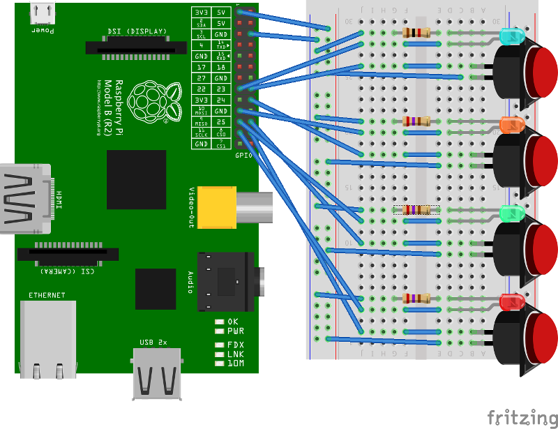

# Code Cracker

A program that generates a code that can be solved by pushing buttons

## Wiring

I used 4 different coloured push buttons with built-in LEDs and connected them to the GPIO pins of a Raspberry Pi 1 rev 2 which I had laying around.

## License

MIT license, see the [`LICENSE`](LICENSE) file.

